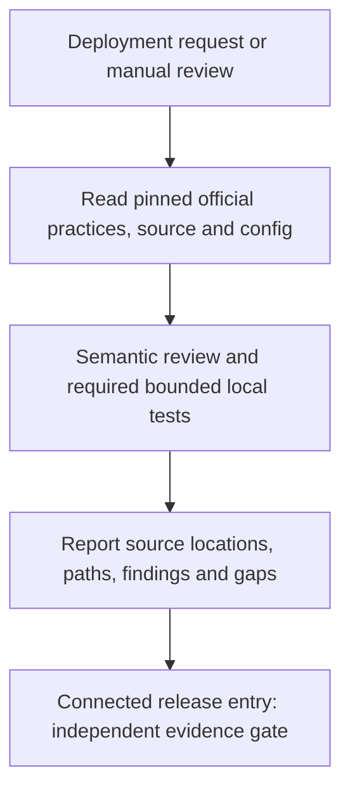

# Cloudflare Cost Safety

[简体中文](README.md) | **English**

[](https://github.com/ROTFEAT/cloudflare-preflight/actions/workflows/verify.yml)
**Version 1.0.2** · Codex Skill · [MIT](LICENSE) · [Changelog](CHANGELOG.md)

**Required checks before deploying to Cloudflare**

`cloudflare-cost-safety` is a cost review Skill for Codex. It checks your code and configuration before release to help you find problems that can make Cloudflare costs grow unexpectedly:

- **Background tasks keep running:** Alarms repeatedly trigger storage reads and writes even without new requests.
- **Queue tasks repeat:** Processing one message creates another, so the same logical task keeps running.
- **Database operations touch too much data:** A query returns one row but reads many, or an update intended for one record changes the whole table.
- **Tasks run too often or in too many environments:** Backups, synchronization, or polling run too frequently, or several preview environments all run the same background jobs.

The review tells you where the risks are, why they create extra usage, what limits are needed, and which tests remain unfinished. Run it before deployment, or start an early review through the `/skills` selector or an explicit `$cloudflare-cost-safety` mention.

[See it in action](#see-it-in-action) · [Quick start](#quick-start) · [Why it exists](#why-this-skill-exists) · [Boundaries](#boundaries) · [Documentation and verification](#documentation-and-verification)

## See it in action

### A query returns one row but reads many

The same query, with `LIMIT 1` in both cases:

```sql
SELECT id FROM jobs WHERE status = 'rare' ORDER BY value LIMIT 1;
```

| Local test scenario | Rows returned | Actual `rowsRead` |
| --- | ---: | ---: |
| 10,000 rows without a matching index | 1 | **10,001** |
| The same data with a matching index | 1 | **1** |

These are saved **local workerd / Durable Objects SQL measurements**, illustrating the difference between rows returned and rows read. The exact values belong to this test dataset. See the [raw log](docs/test-results/workerd.log) and [test code](tests/runtime/mechanisms.spec.js).

### An alarm keeps scheduling another run

In a historical test application, activation starts an alarm. The alarm performs storage work and schedules another alarm. An excerpt from its report:

> **BLOCK · gate DENY**
>
> Official best practices: **PASS**. Cost safety: **BLOCK**.
>
> **CF-DO-001 · `main.js:5`** — Object activation starts an alarm that performs storage work and schedules another alarm without a durable work boundary
>
> Path: `alarm → setAlarm`

The [full report](docs/test-results/forward/corrected/activated/report.md) also preserves unknowns and uncompleted tests. This historical example shows how a finding is reported; it cannot approve a current application release.

## Quick start

### 1. Install into the application you want to review

Requirements: **Linux, Node ≥22, Python ≥3.10, bubblewrap, and libseccomp2**. The offline sandbox uses `/usr/bin/node`. For Node installed through nvm or a tool cache, see the [usage guide](docs/usage.en.md).

```sh
git clone https://github.com/ROTFEAT/cloudflare-preflight.git
cd cloudflare-preflight
npm ci --ignore-scripts --registry=https://registry.npmjs.org
npm run install-skill -- --project /ABSOLUTE/APPLICATION
```

Replace `/ABSOLUTE/APPLICATION` with your application directory. The installer writes `.agents/skills/cloudflare-cost-safety/` inside that application, copies prepared dependencies offline, and refuses to overwrite an existing installation. Confirm Codex discovers the Skill; restart the client if it does not appear.

### 2. Choose a review entry point

**Before deployment**

Give Codex the deployment task and explicitly request the review first:

```text
Deploy this project to Cloudflare production after completing the cost safety review.
```

Deployment, publishing, previews, staging, version promotion, and rollback are in scope, including release commands wrapped by npm or frameworks. Ordinary edits and confirmed local-only builds/tests do not trigger the default review.

The Skill description guides the host toward preflight for these tasks. Implicit matching depends on the client version; the complete trigger matrix has not been verified. The controlled release entry runs the independent gate explicitly.

**Manual review: select the Skill through /skills**

In supported Codex CLI/IDE clients, enter `/skills` and select **cloudflare-cost-safety**. You can also mention it explicitly in a conversation:

```text
$cloudflare-cost-safety Review this project's Cloudflare cost risks and generate a report. Do not deploy yet.
```

The `/` entry uses the host's `/skills` selector; available menus depend on the client version. [Official invocation documentation](https://developers.openai.com/codex/skills/) · [CLI and CI usage](docs/usage.en.md)

## Why this Skill exists

Developers' public billing accounts, incident writeups, and community reviews exposed recurring problems. This project turns those mechanisms into predeployment checks.

**Background tasks keep running without new users**

Will Moss described alarms scheduled during activation/initialization and preview environments multiplying background work. We check who starts an alarm, what keeps it running, and whether budgets survive object reactivation. [First-person account](https://news.ycombinator.com/item?id=47787042)

**Processing a message creates another message**

RetainDB's account and corrections describe a Queue → API → Queue chain that creates fresh messages. We review the identity, hop count, and cumulative work of the logical task. The incident also involved repeated writes, KV, and external traffic; its entire bill cannot be attributed to one loop. [Original account and corrections](https://www.reddit.com/r/CloudFlare/comments/1t1e8nh/i_accidentally_generated_16_billion_durable/)

**An update intended for one record changes the whole table**

OSM's postmortem describes a refactor that removed WHERE from an UPDATE. We inspect actual read/write scope alongside missing indexes, stalled batch progress, and repeated upserts. [Author's postmortem](https://www.ofsecman.io/post/postmortem-5-000-incident-in-10-seconds-due-to-cloudflare-d1)

Other cases cover R2 synchronization frequency, client polling, and loops inside a small number of DOs. Together, these mechanisms inform [12 P0 rules](rules/catalog.json). All cases and their sources are preserved below.

<details>
<summary><strong>Expand all 9 cases and 15 message/community sources</strong></summary>

These nine cases and 15 message/community sources come from the project's original requirements. The table distinguishes first-person accounts, snippets, and secondary archives. We have not independently audited their invoices or complete production code. Cases motivate mechanisms; official documentation and controlled tests support technical judgments. Amounts and causal caveats are preserved in [section 5 of the original requirements, in Chinese](docs/requirements.zh-CN.md).

| Case | Reported problem and resulting review focus | Sources and evidence type |
| --- | --- | --- |
| C01 · shmily7 | DO alarm loops and recurring storage usage; inspect rescheduling and cumulative work | [Original X post](https://x.com/shmily7/status/2107481028726251762), [Billflare secondary archive](https://billflare.dev/cases/shmily7-durable-object-alarm); the full narrative mainly relies on secondary material |
| C02 · Will Moss | Activation/initialization repeatedly schedules alarms; multiple previews amplify background work | [Hacker News self-report](https://news.ycombinator.com/item?id=47787042), [Reddit self-report](https://www.reddit.com/r/CloudFlare/comments/1snckwa/cautionary_tale_for_anyone_using_cloudflare/); two accounts of one incident |
| C03 · RetainDB | Queue → API → Queue feedback, repeated writes, KV fallback scans, and external traffic interact | [Reddit self-report and corrections](https://www.reddit.com/r/CloudFlare/comments/1t1e8nh/i_accidentally_generated_16_billion_durable/); the entire bill cannot be attributed to one loop |
| C04 · Nathan Schram | Cron/batch jobs repeatedly process the same data; inspect durable progress and crash replay | [Author's incident writeup](https://littlebearapps.com/blog/d1-billing-disaster-circuit-breakers/) |
| C05 · OSM | A refactor removes WHERE, changing an update by ID into a full-table UPDATE | [Author's postmortem and code fragment](https://www.ofsecman.io/post/postmortem-5-000-incident-in-10-seconds-due-to-cloudflare-d1) |
| C06 · Daryl Ginn | High D1 reads; the archive attributes amplification to indexes omitted during migration | [Original X post](https://x.com/darylginn/status/2082413530243043780), [Billflare secondary archive](https://billflare.dev/cases/darylginn-d1-missing-index); original snippets plus a secondary causal explanation |
| C07 · Justin Schroeder | A small number of DOs loop internally; few instances do not establish low usage | [Original X post](https://x.com/jpschroeder/status/2086144942657712500), [Billflare secondary archive](https://billflare.dev/cases/standard-agents-durable-objects); no complete code establishing a specific alarm implementation |
| C08 · Lucian Ghinda | Frequent Litestream/R2 replication operations; inspect synchronization intervals and environment multipliers | [Original X post](https://x.com/lucianghinda/status/1957738066816446683), [Billflare secondary archive](https://billflare.dev/cases/lucianghinda-r2-replication); original snippets plus secondary mechanism details |
| C09 · KurosawaGeeker | Voting-site and community review experience; inspect polling, caching, and Worker request paths | [cloudflare-cost-playbook](https://github.com/KurosawaGeeker/cloudflare-cost-playbook), [community cloudflare-cost-review Skill](https://raw.githubusercontent.com/KurosawaGeeker/cloudflare-cost-playbook/refs/heads/docs/cloudflare-cost-playbook/SKILL.md); a community repository's account and reference implementation |

Attribution is preserved, and reposts of one incident are not counted as separate cases. Machine-readable records are in the [incident index](.agents/skills/cloudflare-cost-safety/assets/incidents.json) and [source index](.agents/skills/cloudflare-cost-safety/assets/sources.json).

</details>

## How the review works



The first CLI pass usually returns **INCOMPLETE**: actual semantic review or required tests are still needed. No static findings or a receipt for reading official files is sufficient on its own.

In a connected release workflow, the independent gate checks trusted signed evidence against current source, final artifacts, configuration, target, policies, and versions. **BLOCK, INCOMPLETE, tool errors, and unapproved REVIEW deny publication.** See the [usage guide](docs/usage.en.md) and [trust/signing documentation, in Chinese](docs/trust.md).

## Boundaries

- **Preflight performs review only.** It does not connect to Cloudflare accounts, hold deployment credentials, publish, or stop existing alarm/Queue work.
- **Installing the Skill does not control every release path.** Direct CLI, dashboard, unconnected Workers Builds, and other CI remain partial coverage and need individual integration.
- **It does not promise a hard monthly spending cap.** Budget alerts, CPU limits, and Queue pauses have specific scopes; none independently establishes an account-wide cap.
- **Unresolved behavior remains unknown or incomplete.** ORM, dynamic dispatch, external SDKs, cloud state, and P1 products have explicit gaps. See [coverage documentation, in Chinese](docs/coverage.md).

## Documentation and verification

| What you want to do | Start here |
| --- | --- |
| Install, inspect versions, run the CLI, understand reports and exit codes | [Usage guide](docs/usage.en.md) |
| Connect a gate to your release workflow | [GitHub Actions and release entry, in Chinese](docs/ci.md) |
| Configure trust, signing, and per-finding approvals | [Trust and signing, in Chinese](docs/trust.md) |
| Inspect supported rules and their test evidence | [Coverage, in Chinese](docs/coverage.md) |
| Read delivery status, original requirements, and retained evidence | [Development report, in Chinese](docs/development-report.zh-CN.md) · [Original requirements, in Chinese](docs/requirements.zh-CN.md) · [Execution records, in Chinese](docs/test-results/README.md) |

With the local prerequisites ready, developers can run:

```sh
npm ci --ignore-scripts --registry=https://registry.npmjs.org
npm test
```

Dependency downloads and offline verification are separate phases. Tests do not connect to Cloudflare accounts. The unified command runs rule, integration, gate, sandbox, real workerd, and clean installation/package checks. The [retained 1.0.2 verification](docs/test-results/v1.0.2/summary.json) contains 104 Node tests, 17 workerd tests, and a package check. Consult [CI](https://github.com/ROTFEAT/cloudflare-preflight/actions/workflows/verify.yml) for subsequent results.

The current version is **1.0.2**. The README, Skill, npm package, and reports use the same three-part version, with Git tag `v1.0.2`. **Every commit increments the version, including documentation and CI changes.** Small changes advance as `1.0.0 → 1.0.1 → 1.0.2`; compatible additions and breaking changes increment MINOR and MAJOR respectively. See the [versioning policy](docs/versioning.md) for the full workflow.

## Official references and acknowledgements

Official dependencies are pinned to `cloudflare/skills@41e0d19858946d18af9ee2c2feebbe2e11d829ff`: `workers-best-practices`, `wrangler`, and conditional `durable-objects`. Entries and applicable references are checked against the [content lock](.agents/skills/cloudflare-cost-safety/official-skills.lock.json) and reviewed.

<details>
<summary><strong>Expand all 17 official references (32 sources including the cases)</strong></summary>

The case table lists all 15 message/community sources. These are all 17 official references from the source index, for 32 sources in total. Official capabilities, metering units, and command semantics are checked against the appropriate official references; community material provides incident context and practical experience.

| Topic | Official sources |
| --- | --- |
| DO alarms and storage metering | [Alarms](https://developers.cloudflare.com/durable-objects/api/alarms/), [SQLite storage API](https://developers.cloudflare.com/durable-objects/api/sqlite-storage-api/) |
| D1 row metering | [D1 Pricing](https://developers.cloudflare.com/d1/platform/pricing/) |
| Queue retry and pause scopes | [Batching and retries](https://developers.cloudflare.com/queues/configuration/batching-retries/), [Pause and purge](https://developers.cloudflare.com/queues/configuration/pause-purge/) |
| Local runtime tests | [Workers Vitest test APIs](https://developers.cloudflare.com/workers/testing/vitest-integration/test-apis/) |
| Worker limits and billing | [Platform limits](https://developers.cloudflare.com/workers/platform/limits/), [Pricing](https://developers.cloudflare.com/workers/platform/pricing/) |
| KV billing | [Workers KV Pricing](https://developers.cloudflare.com/kv/platform/pricing/) |
| R2 request classes and billing | [R2 Pricing](https://developers.cloudflare.com/r2/pricing/) |
| Budget notifications | [Budget alerts](https://developers.cloudflare.com/billing/manage/budget-alerts/) |
| Official Agent Skills | [cloudflare/skills](https://github.com/cloudflare/skills), [workers-best-practices entry](https://raw.githubusercontent.com/cloudflare/skills/main/skills/workers-best-practices/SKILL.md), [durable-objects entry](https://raw.githubusercontent.com/cloudflare/skills/main/skills/durable-objects/SKILL.md), [wrangler entry](https://raw.githubusercontent.com/cloudflare/skills/main/skills/wrangler/SKILL.md) |
| Workers Builds release configuration | [Builds configuration](https://developers.cloudflare.com/workers/ci-cd/builds/configuration/) |
| Codex Skill discovery and invocation | [OpenAI Skills](https://developers.openai.com/codex/skills/) |

Upstream main links locate the material; execution uses the pinned commit and content hashes described above. Thanks to the authors of Cloudflare's official Skills and documentation, developers who publicly shared incidents, and the KurosawaGeeker community project. Source status and verification dates are recorded in [sources.json](.agents/skills/cloudflare-cost-safety/assets/sources.json).

</details>

Thanks to developers who publicly shared incidents, the authors of Cloudflare's official Skills and documentation, and the KurosawaGeeker community project.

## License

Project code uses the [MIT License](LICENSE). Bundled Cloudflare Skills retain their [Apache-2.0 license](.agents/skills/cloudflare-cost-safety/vendor/CLOUDFLARE-LICENSE) and [attribution](.agents/skills/cloudflare-cost-safety/vendor/NOTICE). Prepared third-party dependencies retain their own licenses.
