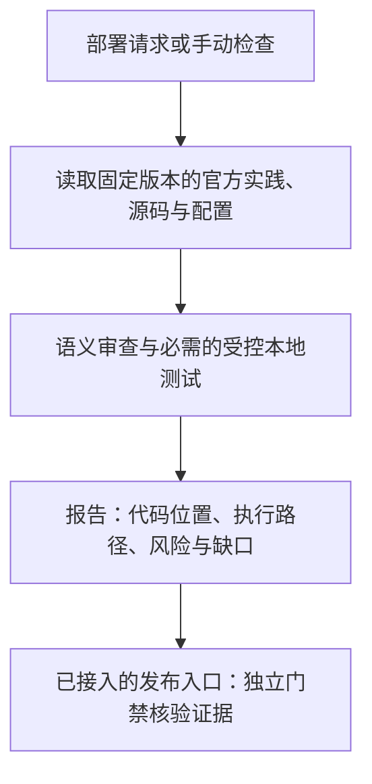

# cloudflare-preflight

**简体中文** | [English](README.en.md)

[](https://github.com/ROTFEAT/cloudflare-preflight/actions/workflows/verify.yml)
**版本 1.0.3** · Codex Skill · [MIT](LICENSE) · [更新日志](CHANGELOG.md)

**Cloudflare 部署前必须做的检查**

`cloudflare-cost-safety` 是一个给 Codex 用的成本检查 Skill，帮你在上线前检查代码和配置，提前发现容易让 Cloudflare 费用超出预期的问题：

- **后台任务一直跑：** 没有新请求，Alarm 仍在反复触发，持续读写数据；有些问题要到刷新或过期时间才出现。
- **队列任务反复执行：** 一条消息处理完，又创建下一条消息，同一个任务一直重复。
- **数据库读写太多：** 查询只返回一行，却读取了很多行；本来只想改一条记录，却更新了整张表。
- **任务频率或环境数量太多：** 备份、同步、轮询过于频繁，或者多个预览环境都在运行同一套后台任务。
- **收费源站能被直接访问：** Cloudflare 入口设置了保护，下游服务的公开地址或其他入口仍可能被绕过调用。

检查会告诉你：哪里有风险、为什么会产生额外用量、需要补什么限制，以及还有哪些测试没完成。可以在部署前检查，也可以通过 `/skills` 选择 Skill，或用 `$cloudflare-cost-safety` 提前手动检查。

报告会分别列出代码限制、本地测试结果和未核验的云端控制。涉及 Alarm、Cron、Queue 或公开代理时，还会要求适用的时间边界、停止行为和源站访问验证，见[补充检查说明](.agents/skills/cloudflare-cost-safety/references/delayed-and-origin-checks.md)。

[先看效果](#先看检查效果) · [快速上手](#快速上手) · [项目由来](#为什么会有这个-skill) · [使用边界](#使用边界) · [文档与验证](#文档与验证)

## 先看检查效果

### 查询只返回一行，却读了很多行

同一条查询，都是 `LIMIT 1`：

```sql
SELECT id FROM jobs WHERE status = 'rare' ORDER BY value LIMIT 1;
```

| 本地测试场景 | 返回行数 | 实际 `rowsRead` |
| --- | ---: | ---: |
| 10,000 行数据，缺少匹配索引 | 1 | **10,001** |
| 同样的数据，添加匹配索引 | 1 | **1** |

这是已保存的 **workerd / Durable Objects SQL 本地实测**，用于说明“返回行数”和“读取行数”的差别；具体数值属于这个测试数据集。见 [原始日志](docs/test-results/workerd.log)与[测试代码](tests/runtime/mechanisms.spec.js)。

### Alarm 执行后反复安排下一次任务

历史测试项目中的对象激活后启动 Alarm，Alarm 执行存储工作，再次安排下一次 Alarm。报告摘录：

> **BLOCK · gate DENY**
>
> Official best practices: **PASS**. Cost safety: **BLOCK**.
>
> **CF-DO-001 · `main.js:5`** — Object activation starts an alarm that performs storage work and schedules another alarm without a durable work boundary
>
> Path: `alarm → setAlarm`

[完整报告](docs/test-results/forward/corrected/activated/report.md)同时保留未知项和未完成测试。这个历史样例展示了检查如何指出风险，不能用于批准当前应用发布。

## 快速上手

### 1. 安装到要检查的项目

需要 **Linux、Node ≥22、Python ≥3.10、bubblewrap 和 libseccomp2**。离线沙箱使用 `/usr/bin/node`；nvm／工具缓存安装的 Node 如何准备，见[使用指南](docs/usage.zh-CN.md)。

```sh
git clone https://github.com/ROTFEAT/cloudflare-preflight.git
cd cloudflare-preflight
npm ci --ignore-scripts --registry=https://registry.npmjs.org
npm run install-skill -- --project /ABSOLUTE/APPLICATION
```

把 `/ABSOLUTE/APPLICATION` 替换为你的应用目录。安装器把 Skill 放入应用的 `.agents/skills/cloudflare-cost-safety/`，离线复制已准备的依赖，不覆盖现有安装。安装后确认 Codex 能发现 Skill；未显示时重新启动客户端。

### 2. 选择检查入口

**部署前检查**

向 Codex 给出部署任务，并明确要求先检查：

```text
把这个项目部署到 Cloudflare production，先完成成本安全检查。
```

部署、发布、preview、staging、版本晋升和 rollback 都属于检查范围，包括 npm／框架脚本包装的发布命令。普通编辑和已确认的纯本地 build／test 不会默认触发。

Skill 描述引导宿主在这些任务中选用预检；隐式匹配依赖客户端版本，本项目尚未验证完整触发矩阵。受控发布入口会显式运行独立门禁。

**手动检查：通过 /skills 选择 Skill**

在支持的 Codex CLI／IDE 中输入 `/skills`，选择 **cloudflare-cost-safety**。也可以直接在对话中显式提及：

```text
$cloudflare-cost-safety 检查当前项目的 Cloudflare 成本风险，生成报告，先不要部署。
```

这里的 `/` 入口是宿主的 `/skills` 选择器，具体菜单以客户端版本为准。[官方调用说明](https://developers.openai.com/codex/skills/) · [命令行／CI 用法](docs/usage.zh-CN.md)

## 为什么会有这个 Skill

它来自开发者公开分享的账单经历、事故复盘和社区审查经验。我们把其中反复出现的问题整理成部署前检查规则。

**没有新用户，后台任务仍在反复运行**

Will Moss 的自述描述了唤醒／初始化时安排 Alarm，以及 preview 环境放大后台工作的问题。我们据此检查：谁启动 Alarm、什么让它继续、对象重新激活后预算是否仍然有效。[作者自述](https://news.ycombinator.com/item?id=47787042)

**消息处理完，又创建了下一条消息**

RetainDB 的自述与更正涉及 Queue → API → Queue 创建新消息的反馈链。我们检查整个逻辑任务的身份、跳数和累计工作量。原帖还涉及重复写入、KV 与外部流量，不能把全部账单归因于一条循环。[原帖与更正](https://www.reddit.com/r/CloudFlare/comments/1t1e8nh/i_accidentally_generated_16_billion_durable/)

**原本只想更新一条记录，实际更新了整张表**

OSM 的复盘描述了重构移除 WHERE 后的全表 UPDATE。我们据此检查实际读写范围，并结合缺索引、批处理进度停滞和重复 upsert 等机制检查放大路径。[作者复盘](https://www.ofsecman.io/post/postmortem-5-000-incident-in-10-seconds-due-to-cloudflare-d1)

其他案例还覆盖 R2 同步频率、客户端轮询和少量 DO 内部循环。这些问题共同构成 [12 条 P0 规则](rules/catalog.json)。下方保留全部案例与出处。

<details>
<summary><strong>展开全部 9 个案例与 15 条消息／社区来源</strong></summary>

以下 9 个案例、15 条消息／社区来源来自项目原始需求。表中区分作者自述、原帖片段和二手归档；本项目未独立审计其账单或完整生产代码，案例用于选择风险机制，技术判断另以官方资料与测试支撑。金额和因果限制见 [原始需求第 5 节](docs/requirements.zh-CN.md)。

| 案例 | 资料中描述的问题与本项目关注点 | 消息来源与资料类型 |
| --- | --- | --- |
| C01 · shmily7 | DO Alarm 循环与持续读写；检查自我调度和累计工作量 | [X 原帖](https://x.com/shmily7/status/2107481028726251762)、[Billflare 二手归档](https://billflare.dev/cases/shmily7-durable-object-alarm)；完整叙述主要来自二手资料 |
| C02 · Will Moss | 唤醒／初始化反复安排 Alarm，多个 preview 放大后台工作 | [Hacker News 自述](https://news.ycombinator.com/item?id=47787042)、[Reddit 自述](https://www.reddit.com/r/CloudFlare/comments/1snckwa/cautionary_tale_for_anyone_using_cloudflare/)；同一事件的两个来源 |
| C03 · RetainDB | Queue → API → Queue 新消息反馈，重复写入、KV 回退扫描及外部流量共同放大 | [Reddit 自述与后续更正](https://www.reddit.com/r/CloudFlare/comments/1t1e8nh/i_accidentally_generated_16_billion_durable/)；不能把全部费用归结为单一循环 |
| C04 · Nathan Schram | Cron／批处理反复处理同批数据；检查持久进度和故障重放 | [作者复盘](https://littlebearapps.com/blog/d1-billing-disaster-circuit-breakers/) |
| C05 · OSM | 重构移除 WHERE，让按 ID 更新变成全表 UPDATE | [作者复盘与代码片段](https://www.ofsecman.io/post/postmortem-5-000-incident-in-10-seconds-due-to-cloudflare-d1) |
| C06 · Daryl Ginn | D1 高读取量；归档把放大原因指向迁移遗漏索引 | [X 原帖](https://x.com/darylginn/status/2082413530243043780)、[Billflare 二手归档](https://billflare.dev/cases/darylginn-d1-missing-index)；原帖片段与二手原因说明 |
| C07 · Justin Schroeder | 少量 DO 内部循环；不能以实例少推断费用低 | [X 原帖](https://x.com/jpschroeder/status/2086144942657712500)、[Billflare 二手归档](https://billflare.dev/cases/standard-agents-durable-objects)；缺少完整代码，不指定为某种 Alarm 实现 |
| C08 · Lucian Ghinda | Litestream／R2 复制操作密集；检查同步周期与环境乘数 | [X 原帖](https://x.com/lucianghinda/status/1957738066816446683)、[Billflare 二手归档](https://billflare.dev/cases/lucianghinda-r2-replication)；原帖片段与二手机制说明 |
| C09 · KurosawaGeeker | 投票站与社区成本审查经验；关注轮询、缓存和 Worker 请求路径 | [cloudflare-cost-playbook](https://github.com/KurosawaGeeker/cloudflare-cost-playbook)、[社区 cloudflare-cost-review Skill](https://raw.githubusercontent.com/KurosawaGeeker/cloudflare-cost-playbook/refs/heads/docs/cloudflare-cost-playbook/SKILL.md)；社区仓库自述与参考实现 |

这些来源各自保留出处；多个平台转载同一事故不重复计数。机器可读记录见 [案例索引](.agents/skills/cloudflare-cost-safety/assets/incidents.json)和[来源索引](.agents/skills/cloudflare-cost-safety/assets/sources.json)。

</details>

## 检查如何工作



第一遍 CLI 运行通常返回 **INCOMPLETE**：还需要真实语义审查或必需测试。静态扫描没有发现、读过官方文件，都不能单独作为放行依据。

接入受控发布流程后，独立门禁核对可信签名证据与当前源码、最终产物、配置、目标、策略及版本。**BLOCK、INCOMPLETE、工具错误和未批准的 REVIEW 都会拒绝发布。** 具体流程见[使用指南](docs/usage.zh-CN.md)和[签名与信任说明](docs/trust.md)。

## 使用边界

- **预检只做审查。** 不连接 Cloudflare 账户，不持有部署凭证，不发布，也不会停止已运行的 Alarm／Queue 任务。
- **安装 Skill 不会自动管住所有发布路径。** 直接 CLI、控制台、未接入的 Workers Builds 或其他 CI 仍属于部分覆盖，需要逐个接入受控入口。
- **它不承诺月度金额硬上限。** 预算告警、CPU 限制和 Queue 暂停各有作用范围，不能直接当作账户费用封顶。
- **看不清的部分会保留为未知或未完成。** ORM、动态派发、外部 SDK、云端状态及 P1 产品有明确缺口，见[覆盖说明](docs/coverage.md)。

## 文档与验证

| 你想做什么 | 从这里开始 |
| --- | --- |
| 安装、查看版本、运行 CLI、理解报告与退出码 | [使用指南](docs/usage.zh-CN.md) |
| 把门禁接入发布流程 | [GitHub Actions 与发布入口](docs/ci.md) |
| 配置信任、签名与逐项审批 | [签名与信任](docs/trust.md) |
| 了解规则支持范围与测试依据 | [覆盖说明](docs/coverage.md) |
| 查看已完成工作、原始需求和保留证据 | [交付报告](docs/development-report.zh-CN.md) · [原始需求](docs/requirements.zh-CN.md) · [实际运行记录](docs/test-results/README.md) |

开发者准备好上述本地环境后，可以运行：

```sh
npm ci --ignore-scripts --registry=https://registry.npmjs.org
npm test
```

依赖下载与离线验证分开；测试不连接 Cloudflare 账户。统一命令执行规则、集成、门禁、沙箱、真实 workerd 和干净安装／打包检查。1.0.3 的[保留验证记录](docs/test-results/v1.0.3/summary.json)包含 112 个 Node 测试、22 个 workerd 测试及包检查；后续结果以 [CI](https://github.com/ROTFEAT/cloudflare-preflight/actions/workflows/verify.yml) 为准。

当前版本为 **1.0.3**，README、Skill、npm 和报告统一使用三段式版本号，Git 标签为 `v1.0.3`。**每次提交都递增版本号，包括文档和 CI 改动**；小改动依次为 `1.0.1 → 1.0.2 → 1.0.3`。兼容新增和不兼容改动分别递增次版本、主版本，具体流程见[版本管理](docs/versioning.md)。

## 官方资料与致谢

官方依赖固定为 `cloudflare/skills@41e0d19858946d18af9ee2c2feebbe2e11d829ff` 的 `workers-best-practices`、`wrangler` 和按需加载的 `durable-objects`，入口及适用 references 按[内容锁](.agents/skills/cloudflare-cost-safety/official-skills.lock.json)核对并审查。

<details>
<summary><strong>展开全部 17 条官方参考资料（连同案例来源，共 32 条）</strong></summary>

上述案例表列出全部 15 条消息／社区来源。以下再列出来源索引中的全部 17 条官方参考，共 32 条；官方能力、计量单位和命令语义使用相应官方资料核对，社区材料用于问题背景与实践参考。

| 主题 | 官方来源 |
| --- | --- |
| DO Alarm 与存储计量 | [Alarms](https://developers.cloudflare.com/durable-objects/api/alarms/)、[SQLite storage API](https://developers.cloudflare.com/durable-objects/api/sqlite-storage-api/) |
| D1 行计量 | [D1 Pricing](https://developers.cloudflare.com/d1/platform/pricing/) |
| Queues 重试与暂停范围 | [Batching and retries](https://developers.cloudflare.com/queues/configuration/batching-retries/)、[Pause and purge](https://developers.cloudflare.com/queues/configuration/pause-purge/) |
| 本地运行时测试 | [Workers Vitest test APIs](https://developers.cloudflare.com/workers/testing/vitest-integration/test-apis/) |
| Workers 限制与计费 | [Platform limits](https://developers.cloudflare.com/workers/platform/limits/)、[Pricing](https://developers.cloudflare.com/workers/platform/pricing/) |
| KV 计费 | [Workers KV Pricing](https://developers.cloudflare.com/kv/platform/pricing/) |
| R2 请求类别与计费 | [R2 Pricing](https://developers.cloudflare.com/r2/pricing/) |
| 预算告警 | [Budget alerts](https://developers.cloudflare.com/billing/manage/budget-alerts/) |
| 官方 Agent Skills | [cloudflare/skills](https://github.com/cloudflare/skills)、[workers-best-practices 入口](https://raw.githubusercontent.com/cloudflare/skills/main/skills/workers-best-practices/SKILL.md)、[durable-objects 入口](https://raw.githubusercontent.com/cloudflare/skills/main/skills/durable-objects/SKILL.md)、[wrangler 入口](https://raw.githubusercontent.com/cloudflare/skills/main/skills/wrangler/SKILL.md) |
| Workers Builds 发布配置 | [Builds configuration](https://developers.cloudflare.com/workers/ci-cd/builds/configuration/) |
| Codex Skill 发现与调用 | [OpenAI Skills](https://developers.openai.com/codex/skills/) |

上表的上游 main 链接用于定位资料；实际运行使用前文列出的固定 commit 和内容摘要。感谢 Cloudflare 官方 Skill 与文档作者、公开分享事故的开发者，以及 KurosawaGeeker 社区项目。来源状态和核验日期保存在 [sources.json](.agents/skills/cloudflare-cost-safety/assets/sources.json)。

延迟刷新、源站绕过、停止后剩余工作量及报告分层的设计参考了 [ZPVIP/no-billshock@1250f01](https://github.com/ZPVIP/no-billshock/tree/1250f01a085cfe955e1189e38502b5a4428734da)（[MIT](https://github.com/ZPVIP/no-billshock/blob/1250f01a085cfe955e1189e38502b5a4428734da/LICENSE)），并适配到本项目的 Cloudflare 只读预检。该设计参考独立于上面的 32 条案例与官方来源。

</details>

感谢公开分享事故的开发者、Cloudflare 官方 Skill 与文档作者，以及 KurosawaGeeker 社区项目。

## 许可

本项目代码采用 [MIT License](LICENSE)。随包分发的 Cloudflare 官方 Skill 保留其 [Apache-2.0 许可](.agents/skills/cloudflare-cost-safety/vendor/CLOUDFLARE-LICENSE)及[出处说明](.agents/skills/cloudflare-cost-safety/vendor/NOTICE)；准备好的第三方依赖保留各自许可证。
